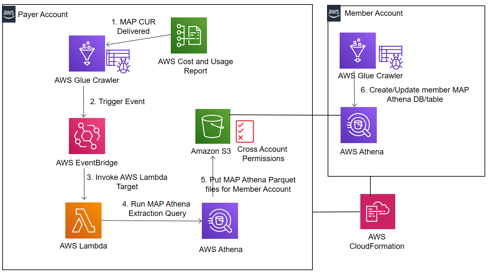

# Automating spend and credits tracking for member accounts in the AWS Migration Acceleration Program (MAP) 

Provides fully automated tracking to member account owners on both their spend and credits for their MAP tagged resources

## How it Works

1.	A custom AWS Config Rule uses the AWS Config Rule Development Kit and CloudKnox REST API to record and evaluate a CloudKnox PCI (Privilege Creep Index) score for every AWS IAM user in your AWS account
2.	If the CloudKnox PCI score is high for that AWS IAM user then AWS Config triggers an automated remediation in real time using AWS Systems Manager Automation
3.	The AWS Systems Manager Automation invokes an AWS Lambda function for rightsizing the permissions of an AWS IAM user with a high Privileged Creep Index (PCI) score
4.	The AWS Lambda function invokes the CloudKnox Just Enough Privileges (JEP) Controller REST API to retrieve the rightsized IAM policy for the user based on the user’s previous activity
5.	The AWS Lambda function provisions the retrieved AWS IAM policy to the user and rightsizes the user’s permissions

## Solution Design

## How To Install

**Prerequisites**

1.	Follow the step by step instructions in the CloudKnox documentation to set up and enable CloudKnox to securely collect AWS CloudTrail logs from your AWS account - https://docs.cloudknox.io/

**Setup** 

2 step install:

1.	Set up the custom AWS Config Rule to evaluate the CloudKnox PCI score for the IAM user
	1.	Follow the Installation steps  of the AWS Config Rule Development Kit (RDK) to set up the prerequisites and install the AWS Config RDK - https://rdk.readthedocs.io/en/latest/getting_started.html#installation
	2.	Download the custom AWS Config rule from the CLOUDKNOX_PCI.zip file provided in our GitHub repository
	3.	Unzip the file above and go to the directory where your RDK Rule files have been unzipped.  For e.g. if the RDK rule folder is named CLOUDKNOX_PCI then cd to that folder
	4.	Deploy the rule by following the deployment instructions as outlined in the RDK. 

2.	Set up the AWS Config Remediation based continuous permissions rightsizing.
	1. Launch the **aws-cloudknox-configremediation.yml** template.
	2. Substitute the <AccountId> and <Region> with the AWS Account ID and AWS Region where you have deployed this template

